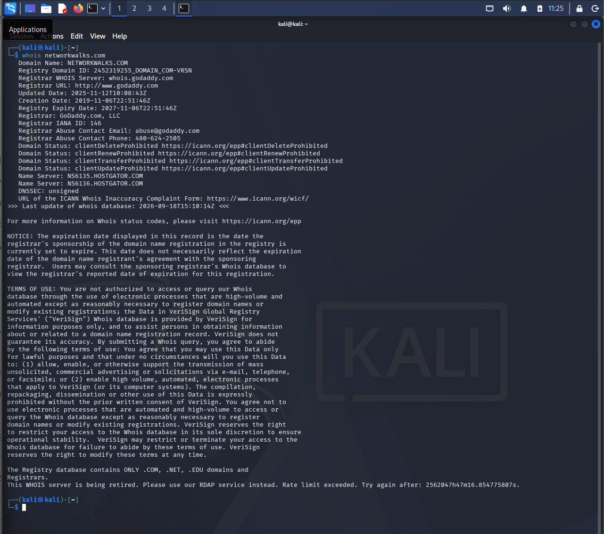
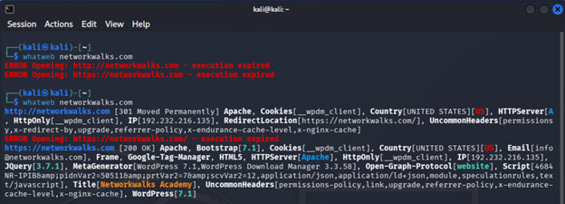
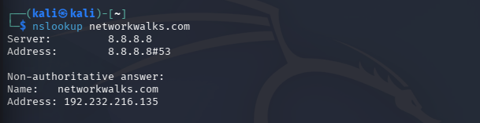
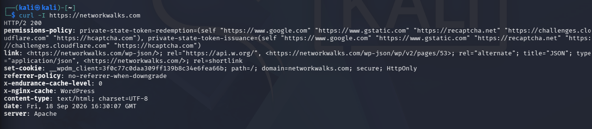
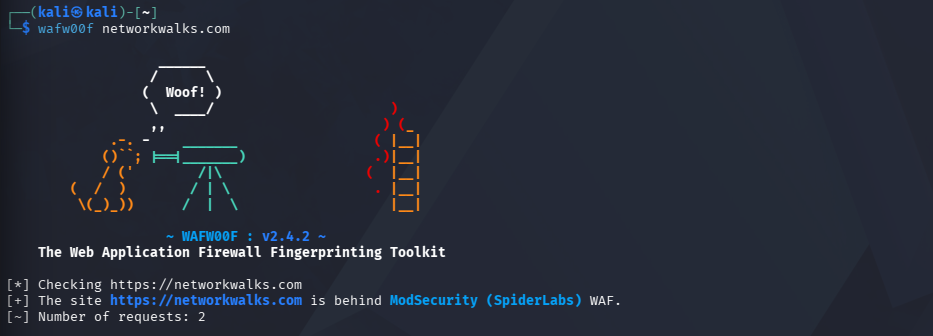
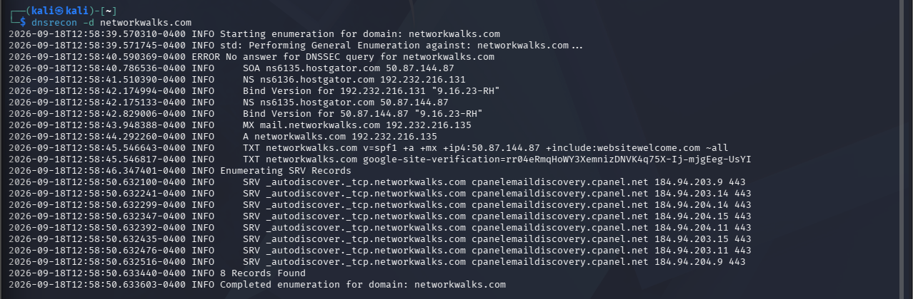
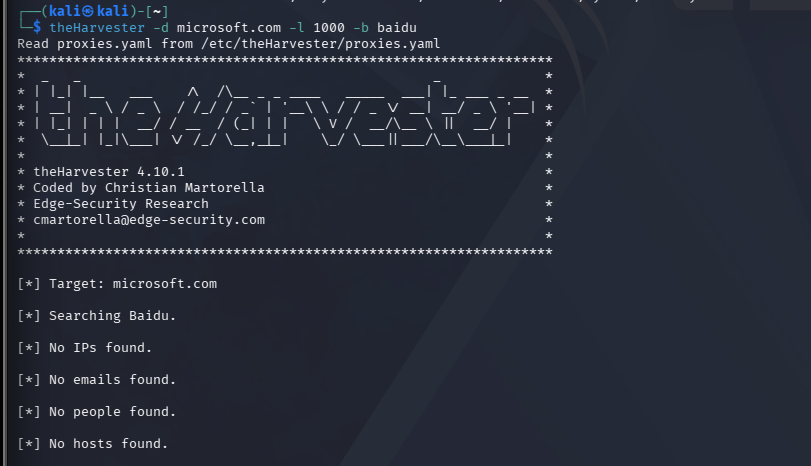
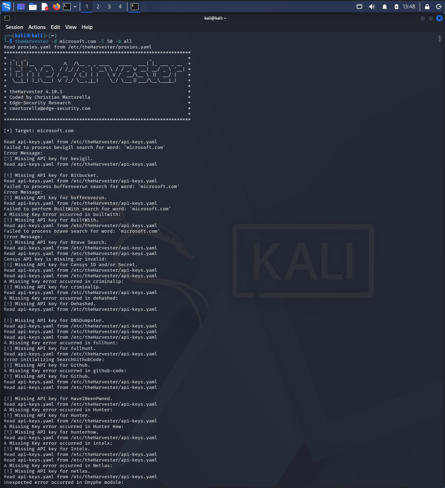
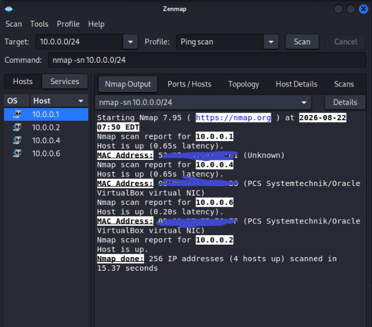
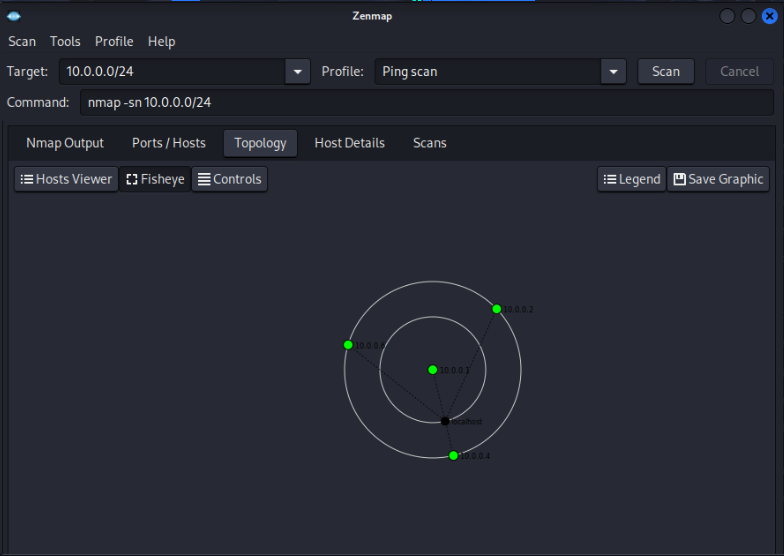

# Footprinting & Reconnaissance Network Scanning Lab

# 🕵️ Footprinting, Reconnaissance & Network Scanning Lab

**Chasing public breadcrumbs and mapping a live network, one command at a time.**

---

## 📑 Table of Contents

- [Backstory](#-backstory)
- [What I Set Out to Do](#-what-i-set-out-to-do)
- [Scope & Authorization](#-scope--authorization)
- [Tools & Techniques Used](#-tools--techniques-used)
- [Walkthrough](#-walkthrough)
- [OSINT Findings Snapshot](#-osint-findings-snapshot)
- [Risk Analysis / Impact](#-risk-analysis--impact)
- [Recommendations](#-recommendations)
- [Lessons Learned](#-lessons-learned)
- [Ethical Use Notice](#-ethical-use-notice)
- [Tools & Resources](#-tools--resources)
- [Author](#-author)
- [Project Info](#-project-info)

---

## 📖 Backstory

After getting my [Kali Linux VirtualBox lab](../../) up and stable, the natural next question was: *okay, now what do I actually do with it?* This repo is the answer — Week 2 of my Cybersecurity & Ethical Hacking internship at Networkwalks, where the lab I built earlier finally got put to work.

The brief had three parts: footprint a real domain using nothing but publicly available information, run an OSINT harvesting tool against a well-known target under strict training conditions, and map out my own local network to see who else is on it. No exploitation, no poking at anything I didn't have permission to touch — just careful, methodical information gathering, which turns out to be most of what security work actually looks like before anything "exciting" happens.

Every command below is one I actually ran, every screenshot is my own output, and every finding is exactly what came back on my screen.

---

## 🎯 What I Set Out to Do

- Footprint the `networkwalks.com` domain using six different Kali Linux tools, without touching anything beyond public information.
- Run **theHarvester** against `microsoft.com` as a strictly authorized, non-intrusive OSINT training exercise, and compare a single-source search against an all-sources search.
- Identify my own LAN subnet and use **Zenmap** to discover live hosts, their IP/MAC addresses, and generate a network topology.
- Turn every finding into something useful — not just "here's some data," but "here's what this means and what I'd tell a client to fix."

---

## 🛡️ Scope & Authorization

Every activity in this lab was performed only against systems and domains I had explicit permission for, or which I own:

| Target | Basis for Testing |
| --- | --- |
| `networkwalks.com` | Written permission secured from Networkwalks |
| `microsoft.com` | theHarvester only — authorized, non-intrusive OSINT training exercise using public sources. No scanning, exploitation, or unauthorized access was performed |
| My own local LAN | Own network, own devices |

⚠️ **Disclaimer:** All material here is for education and research purposes only. Nothing in this repo should be used to test a system you don't have explicit authorization for — that's not a lab exercise anymore, that's a legal problem. Misuse of these techniques can carry criminal charges and a permanent record, even when no actual damage is caused. I'm not responsible for what anyone else does with this information; every action taken is on the person taking it.

---

## 🧰 Tools & Techniques Used

| Tool | Purpose |
| --- | --- |
| 🖥️ Kali Linux & Windows | Operating systems used across the two phases |
| 🌐 WHOIS | Domain registration details — owner, dates, name servers |
| 🕸️ WhatWeb | Fingerprint web technologies (server, CMS, plugins, IP) |
| 📡 nslookup | Resolve a domain name to its IP address via DNS |
| 📥 curl -I | Read raw HTTP response headers |
| 🧱 wafw00f | Detect whether a Web Application Firewall is in front of the site |
| 📚 dnsrecon | Enumerate DNS records (NS, MX, SPF, TXT, SRV) |
| 🧲 theHarvester | Pull public emails, subdomains, hosts, IPs and ASN info (OSINT) |
| 🗺️ Zenmap (Nmap GUI) | Scan the local subnet for live hosts, IPs and MAC addresses |
| ⌨️ Windows CMD | Local IP/MAC identification via `ipconfig` |

---

## 🪜 Walkthrough

### Phase 1 — Footprinting `networkwalks.com` (W2-PM1)

Six tools, one target, zero direct interaction with anything beyond what's publicly exposed. Each one peels back a different layer of the domain.

**Step 1 — WHOIS Domain Lookup**

First stop, always: **WHOIS**. It pulled back the domain's public registration details and name servers — the kind of information that maps out who owns a domain and where it's hosted before you've touched anything else.

**Step 2 — WhatWeb Technology Fingerprinting**

Next I pointed **WhatWeb** at the site to fingerprint what it's actually built on. It came back identifying the CMS as WordPress, along with the active plugins in use and a handful of other details the site was exposing without meaning to.

**Step 3 — nslookup DNS Resolution**

A quick **nslookup** resolved the domain to its public IP address — simple, but it's the anchor point for everything else.

**Step 4 — curl -I Header Inspection**

Running `curl -I` against the site returned its HTTP response headers, which quietly exposed the WordPress REST API endpoint `/wp-json/` — a small detail, but one more piece of the technology puzzle.

**Step 5 — wafw00f WAF Detection**

**wafw00f** checked whether a Web Application Firewall was sitting in front of the site and identified which one was in use.

**Step 6 — DNSRecon DNS Enumeration**

Finally, **DNSRecon** enumerated the domain's DNS records — name servers, mail servers, TXT records, service records, and DNS software details — rounding out the footprint with the full infrastructure picture.

---

### Phase 2 — OSINT Harvesting on `microsoft.com` (W2-PM4)

Separate exercise, separate target, same ground rules: publicly available information only, no scanning, no exploitation. I used **theHarvester** to see how much of a footprint you can build purely from what's already out there.

**Step 7 — theHarvester, Baidu Source Only**

First attempt used a single data source (Baidu). It came back completely empty — zero IPs, zero emails, zero people, zero hosts. Not exactly the dramatic reveal I expected, but a useful reminder that one search engine is not a footprint, it's a sample.

**Step 8 — theHarvester, All Sources**

Re-running the same query with `-b all` told a very different story — 4 ASNs, 1 interesting URL, 138 IP addresses, 3 email addresses and 9,968 hosts surfaced once every available public source was pulled in. The gap between step 7 and step 8 is basically the whole point of OSINT: breadth of sources matters more than any single tool.

---

### Phase 3 — Network Scanning with Zenmap (W2-PM5)

Last stop was closer to home — literally. Time to see what's actually sitting on my own LAN.

**Step 9 — Local Network Ping Scan**

I started with Windows `ipconfig` to confirm my local IP and subnet, fed that subnet into **Zenmap**, and ran a Ping Scan. Four live hosts came back, each with an associated MAC address:

| Host IP |
| --- |
| 10.0.0.1 |
| 10.0.0.2 |
| 10.0.0.4 |
| 10.0.0.6 |

**Step 10 — Network Topology Export**

With the scan done, I opened Zenmap's Topology view, turned on the legend, and exported it as a PDF — a quick visual of exactly who's talking on the network.

---

## 📊 OSINT Findings Snapshot

| Category | Baidu Only | All Sources (`-b all`) |
| --- | --- | --- |
| IP Addresses | 0 | 138 |
| Email Addresses | 0 | 3 |
| Hosts | 0 | 9,968 |
| ASNs | — | 4 |
| Interesting URLs | — | 1 |
| People | 0 | — |
| LinkedIn | — | No results |

---

## ⚠️ Risk Analysis / Impact

These are observations from information-gathering and host-discovery activities — not confirmed vulnerabilities. No exploitation or vulnerability validation was performed in any of the three modules, so a version number, IP address, harvested email, or DNS record here doesn't by itself mean a system is vulnerable. It just means it's worth a closer look.

| # | Finding | Evidence | Potential Impact | Risk |
| --- | --- | --- | --- | --- |
| 1 | Web technology info exposed | WhatWeb identified CMS, version and active plugins | Could help attackers target software that needs a security review | 🟠 Medium |
| 2 | Server IP identifiable | nslookup resolved the domain to a public IP | Reveals the network location of the web service | 🟢 Low |
| 3 | HTTP technical info exposed | curl returned headers + exposed `/wp-json/` | Assists technology fingerprinting and further enumeration | 🟢 Low |
| 4 | WAF technology identifiable | wafw00f identified the WAF in use | Reveals part of the site's security architecture | 🟢 Low |
| 5 | DNS infrastructure info exposed | dnsrecon returned NS, MX and other DNS records | Helps build a broader infrastructure profile | 🟠 Medium |
| 6 | OSINT data publicly harvestable | theHarvester pulled emails, hosts, IP ranges, ASN info | Could feed phishing/social-engineering target lists or expand the mapped attack surface | 🟠 Medium |
| 7 | Multiple live hosts visible on LAN | Zenmap found four live hosts on the local network | Unknown or unauthorized devices could be present | 🟠 Medium |

---

## 🔧 Recommendations

1. **Review publicly exposed technology info** — check periodically what your CMS, plugins and server details reveal to the outside world.
2. **Keep software updated** — CMS platforms and plugins should be patched and checked against current advisories.
3. **Review HTTP headers** — trim anything unnecessary that headers might be exposing.
4. **Review DNS records regularly** — make sure only what needs to be public, is.
5. **Properly configure and monitor the WAF** — keep it enabled and tuned rather than just switched on.
6. **Limit publicly harvestable OSINT info** — run theHarvester against your own domain occasionally to see what's discoverable, and trim what doesn't need to be.
7. **Perform regular internal network discovery** — scan your own network periodically to know what's actually connected.
8. **Investigate unknown devices** — anything unexpected on a scan gets looked at, not ignored.
9. **Maintain network documentation** — topology and device inventories should stay current, not be a one-time snapshot.
10. **Always test with authorization** — reconnaissance, OSINT and scanning only happen where permission has actually been granted.

---

## 💡 Lessons Learned

**A single data source is not a footprint.** The Baidu-only theHarvester run came back completely empty; switching to all sources surfaced thousands of hosts. One tool, one source, one query — none of these alone tell the full story.

**Information gathering does most of the work before anything "exciting" happens.** Six tools against one domain, without a single exploit attempt, still produced a page's worth of findings worth reporting on.

**A finding isn't a vulnerability.** A software version, an exposed header, or a harvested email address is a lead, not proof of a weakness — that distinction matters when writing this up for a client.

**Documentation is half the job.** What was run, what came back, why it matters, and what to do about it — a report that skips any of those four isn't finished.

---

## 🔐 Ethical Use Notice

This repository documents an authorized training exercise only, performed against systems I own, had written permission to test, or used strictly for non-intrusive OSINT training within the bounds described above. Please don't use anything here against a system you don't have explicit authorization for. Unauthorized access is a crime in most jurisdictions even when nothing gets broken.

---

## 🔗 Tools & Resources

- **WhatWeb:** <https://github.com/urbanadventurer/WhatWeb>
- **theHarvester:** <https://github.com/laramies/theHarvester>
- **wafw00f:** <https://github.com/EnableSecurity/wafw00f>
- **DNSRecon:** <https://github.com/darkoperator/dnsrecon>
- **Nmap / Zenmap:** <https://nmap.org/>
- **Kali Linux:** <https://www.kali.org/>

---

## 👤 Author

**Suvayan Ghosh** — Cybersecurity Analyst | Networkwalks Internship, Batch B083D

**LinkedIn:** <https://www.linkedin.com/in/suvayanghosh/>

---

## 📌 Project Info

**Type:** Cybersecurity Internship Lab Report | **Modules:** W2-PM1, W2-PM4, W2-PM5 | **Status:** Completed
